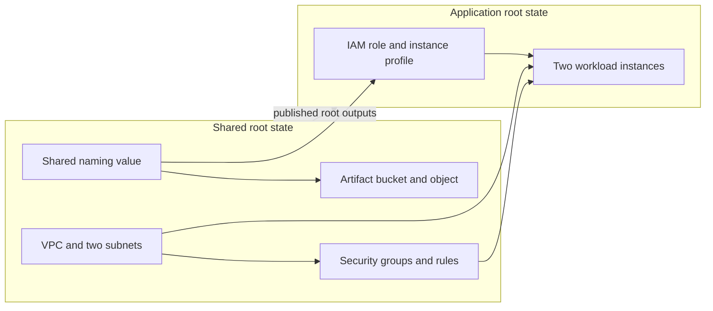

# Terraform Professional Final Closed-Book Simulation

## Lab 1 — Northstar Relay Platform Refactor

**Suggested time:** 70 minutes  
**Difficulty target:** Advanced professional-level practice  
**Delivery mode:** Closed book, individual work

This independent practice lab is not an official HashiCorp examination question.

## Scenario

Northstar Relay operates a small message-processing platform in AWS. The platform was initially delivered as one Terraform root module and now needs to be separated between the platform foundation team and the application runtime team.

The existing remote resources are already running. Their identifiers form the baseline for this lab. The refactor must preserve those resources while introducing clear child-module boundaries and two independently managed root modules.



## Starting Environment

The `student/` directory contains the active monolithic root module and local state prepared by the setup script. The configuration models the deployed environment and should begin with no infrastructure changes.

A partially prepared module workspace is also present. It reflects an unfinished internal refactor and must be reviewed as engineering work, not treated as authoritative.

Runtime-generated baseline evidence is written to `baseline/` by the setup script. Existing resource identifiers recorded there must remain unchanged.

## Required Final Layout

```text
student/
├── infra/
│   ├── shared/
│   └── application/
└── modules/
    ├── network/
    ├── security/
    ├── identity/
    └── compute/
```

The final ownership boundaries are:

| Component | Required owner |
|---|---|
| VPC and subnets | `modules/network` through the shared root |
| Security groups and security-group rules | `modules/security` through the shared root |
| IAM role and instance profile | `modules/identity` through the application root |
| EC2 instances | `modules/compute` through the application root |
| Shared naming value, S3 bucket, and S3 object | Shared root |

## Examination Tasks

### Task 1 — Protect the baseline

Review the current configuration, state, outputs, and generated baseline evidence. Establish that the monolithic root describes the running environment without pending changes. Record any resource addresses needed for your own work.

All existing VPC, subnet, security-group, IAM, EC2, bucket, and object identifiers must be preserved throughout the lab.

### Task 2 — Complete the child-module refactor

Move the existing resources into the required child modules and provide each module with a clear `main.tf`, `variables.tf`, and `outputs.tf` interface.

Child modules must not reference resources inside sibling modules. Cross-module values must pass through a root module. Resource identifiers must not be hardcoded.

Preserve the existing repetition models: the subnet resources remain count-based and the compute instances remain for-each-based.

### Task 3 — Repair the dependency contracts

Make the module interfaces type-safe and complete so that:

- the security module receives the VPC identifier;
- the compute module receives subnet identifiers, security-group identifiers, and the instance-profile name;
- the application root consumes the shared naming value;
- at least one map-shaped module output is consumed by another module through a root module;
- list, set, map, and object values retain deliberate and compatible types.

The partially prepared module workspace contains assumptions that are not all mutually compatible. Resolve them without weakening variable types to `any`.

### Task 4 — Align state ownership with the new addresses

Transition the existing managed objects from their legacy root addresses to the final module addresses without recreating, replacing, or deleting any remote object.

The final state must contain the correct addresses for ordinary resources, the count-based subnets, and the for-each-based instances. No legacy monolithic address may remain.

### Task 5 — Split the roots and states

Create the `shared` and `application` root modules and place each resource under the required ownership boundary.

Both roots must use the existing S3 state bucket. Their backend keys must be exactly:

```text
tfpro-sim/final-06/lab-01/shared.tfstate
tfpro-sim/final-06/lab-01/application.tfstate
```

The application root must read the shared root outputs through remote state. Only a root module may access remote state; child modules must not do so.

At completion:

- the shared state contains only shared-owned resources;
- the application state contains only application-owned resources;
- both roots report zero additions, zero changes, and zero destructions;
- no existing baseline identifier has changed;
- no broad lifecycle suppression is used to conceal configuration drift.

## Exact Constraints

1. The two backend keys are case-sensitive and must match exactly.
2. The generated naming value remains owned by the shared state and is consumed by the application root through an explicit output contract.
3. Existing resources may not be replaced, recreated, or abandoned as unmanaged infrastructure.
4. Child modules may not contain backend or remote-state configuration.
5. Provider binaries, credentials, plan binaries, and local runtime directories must not be committed to the lab directory.

## Completion Evidence

Use `CHECKLIST.md` for a non-prescriptive completion review. Environment startup, reset, and static validation entry points are documented in `ENVIRONMENT.md`.
