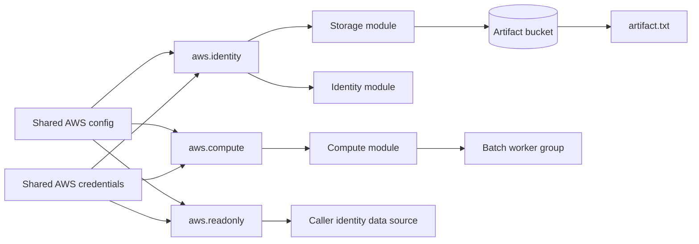

# Lab 02 — Segmented AWS Provider Operations

> Independent Terraform Professional practice lab. This is not an official exam item.

## Scenario

Northstar Media is separating operational duties for a regional batch-processing platform. The existing Terraform state was produced before the identity model, provider ownership rules, and object-resource standard were updated.

The remote environment is already running. Your job is to repair the configuration and state mapping without interrupting the stored release artifact or changing the active worker count.

**Target time:** 50 minutes

**Terraform CLI:** 1.11.x

**Execution target:** LocalStack in `us-east-1`

## Environment state

The platform-specific setup script prepares:

- three assumable LocalStack IAM roles for compute, identity, and read-only operations;
- one launch template and one Auto Scaling group whose remote desired capacity is `1`;
- one managed IAM role and inline policy;
- one S3 bucket containing `artifact.txt` with the exact content `ORIGINAL-CONTENT`;
- a Terraform state in `student/terraform.tfstate` where the object is currently recorded as `aws_s3_bucket_object.legacy_artifact`;
- non-answer baseline evidence under `.exam/`.

Use the Bash or PowerShell setup script that matches your workstation. The reset script discards all candidate changes and reconstructs the initial environment.

## Completion conditions

Complete all five tasks. The final plan must report no create, update, delete, or replacement actions.

### Task 1 — Rebuild the shared identity files

Create these files:

- `student/.aws/config`
- `student/.aws/credentials`

The config file must contain exactly these role profiles and no `default` profile:

- `compute-operator`
- `identity-operator`
- `readonly-auditor`

Every role profile must use `us-east-1`, JSON output, the appropriate role ARN, and a distinct `source_profile`.

The credentials file must contain exactly these LocalStack-only source profiles:

- `compute-origin`
- `identity-origin`
- `audit-origin`

Do not place long-lived or real AWS credentials anywhere in this lab.

### Task 2 — Enforce provider ownership

The root module must expose exactly these aliased AWS provider configurations for workload use:

- `aws.compute`
- `aws.identity`
- `aws.readonly`

Apply these ownership rules:

- the compute module uses `aws.compute`;
- the identity module uses `aws.identity`;
- the storage module uses `aws.identity`;
- `data.aws_caller_identity.current` uses `aws.readonly`;
- each module receives its provider explicitly from the root module;
- child modules declare the aliases they accept and do not create independent AWS provider configurations;
- no resource or data source may rely on implicit default-provider inheritance.

### Task 3 — Upgrade the AWS provider safely

Replace the obsolete exact provider pin with an explicit compatible range that:

- allows AWS provider versions from `5.80.0` inclusive;
- excludes version `6.0.0` and later;
- is not an unbounded or `latest` selection.

Refresh the dependency lock file so it agrees with the selected constraint. Initialization must complete without a provider-version conflict.

### Task 4 — Reconcile the existing object without remote mutation

The existing `artifact.txt` object must finish under this resource address:

`aws_s3_object.artifact`

The final result must satisfy all of the following:

- `aws_s3_bucket_object.legacy_artifact` is absent from both configuration and state;
- the bucket and object key do not change;
- the object body remains exactly `ORIGINAL-CONTENT` with no trailing newline;
- the object is not deleted, recreated, or overwritten;
- no direct editing of Terraform state JSON is permitted.

### Task 5 — Preserve externally controlled capacity

The configuration must continue to declare a desired capacity of `2`, while the remote Auto Scaling group remains at `1`.

Terraform must ignore drift for only the desired-capacity attribute. It must continue to detect changes to all other managed attributes, and the resource must remain in state.

## Submission evidence

Before considering the lab complete, confirm that:

- the required profile and credential files exist with only the permitted sections;
- all AWS consumers use explicit provider ownership;
- the dependency lock agrees with the provider constraint;
- the legacy object address is gone and the target address exists;
- the object identity and exact body match the baseline evidence;
- the remote desired capacity is still `1`;
- the final plan is clean.
