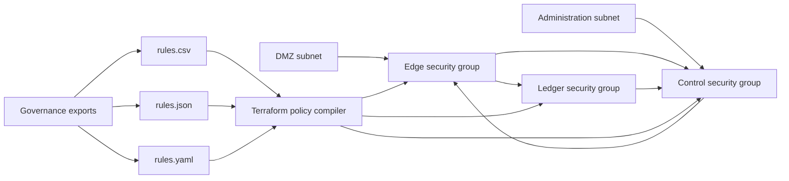

# Lab 03 — Data-Driven Network Policy

## Scenario

Quartz Relay operates an internal service platform in a pre-provisioned AWS network. The network baseline is managed by another team and must be discovered rather than recreated. Security policy is supplied by governance tooling in CSV, JSON, or YAML format, depending on the exporting system.

The current Terraform configuration was recovered from an incomplete migration. It is close to the intended design, but it does not reliably compile all supported policy formats into stable security-group rule resources.

## Exam conditions

- Suggested time limit: **45 minutes**.
- Treat the bootstrap infrastructure as existing infrastructure owned by another team.
- Work only in `student/`.
- Do not change the source data to make the Terraform configuration easier.
- The three input files represent the same logical policy and must produce equivalent managed rules.
- The assessed outcomes below are independent; their lettering does not imply a recommended implementation order.

## Existing environment

The setup automation provisions one VPC, two subnets, and three security groups in LocalStack. Their names include an environment-specific suffix. The student configuration receives only that suffix and must discover identifiers and CIDR blocks through read-only data sources.

| Logical role | Existing object |
|---|---|
| `dmz` | Subnet used for public-facing traffic |
| `admin` | Subnet used for administrative traffic |
| `edge` | Security group for entry services |
| `ledger` | Security group for stateful data services |
| `control` | Security group for operational services |

Use the setup or reset script matching your shell. Docker Desktop, Docker Compose, Terraform CLI 1.11.x, and either Bash or PowerShell are expected.

## Required outcomes

### A. Stable managed rules

Manage all enabled ingress policy rows with exactly one `aws_vpc_security_group_ingress_rule` resource block.

- Use `for_each` and a `for` expression.
- Do not use `count` for the rule resource.
- Do not create one resource block per policy row.
- Permanent resource addresses must not depend on array position or file order.
- The identity must distinguish source, destination, protocol, start port, and end port.
- Two enabled rules target `control` on TCP port `8082`; both must exist because their sources differ.

### B. External policy formats

The variable `rules_format` must accept `csv`, `json`, or `yaml`, with `csv` as its default.

- Use the matching Terraform decoder for each format.
- Keep one shared rule-processing path and one rule resource block.
- Do not hardcode behavior by source-file row number.

### C. Canonical policy model

Create `local.normalized_rules` so every supported input produces the same Terraform value shape and logical values for:

- `direction`
- `source`
- `destination`
- `from_port`
- `to_port`
- `protocol`
- `source_selector`
- `description`
- `enabled`

Ports must be numbers or `null`, `enabled` must be a boolean, and protocol values must be normalized. Empty port fields and `null` values represent the same absence of a port.

### D. Source resolution and filtering

Only enabled ingress rows are managed.

- A source value of `-` is meaningful and must be resolved through `source_selector` to an existing subnet CIDR.
- A named security-group source must resolve to an existing security-group identifier.
- CIDR-based rules set only `cidr_ipv4`.
- Security-group-based rules set only `referenced_security_group_id`.
- The two arguments are mutually exclusive for every managed rule.
- A protocol value of `-1` must be represented without invalid port arguments.
- Existing VPC, subnet, and security-group values must be obtained dynamically; no fixed cloud identifiers or fixed environment CIDRs are permitted.

### E. Inspection outputs

Provide these outputs with values derived from the canonical policy and managed resources:

- `normalized_rules`
- `ingress_rule_keys`
- `rules_by_destination`
- `rules_count_by_protocol`
- `source_types`
- `created_rule_ids`

`ingress_rule_keys` must make it possible to verify that the two `control` TCP `8082` rules have distinct addresses. Collections exposed as lists must have list semantics rather than unordered set semantics.

## Completion constraints

- Reordering rows in any input file must not change the resource-address set.
- Egress and disabled rows must not be managed.
- All three formats must describe the same resulting policy.
- Do not modify bootstrap resources.
- Do not add real cloud credentials, provider binaries, generated plans, or local state files to the submission.
- This is an original practice scenario and is not represented as an official exam question.
