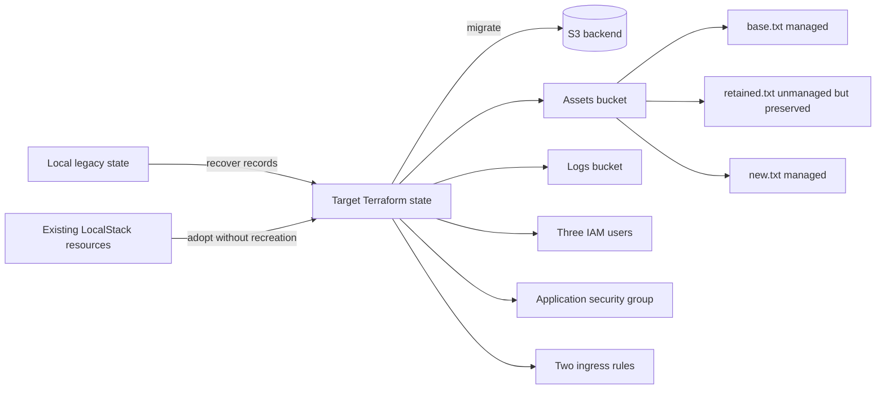

# Terraform Professional Closed-Book Simulation — Lab 04

## State Recovery and Ownership Transfer

**Recommended time limit:** 45 minutes  
**Mode:** Closed-book readiness assessment  
**Environment:** Terraform CLI 1.11.x, Docker Desktop, Docker Compose, LocalStack

This is an independently authored practice lab. It is not an official HashiCorp exam question.

## Scenario

A platform team interrupted a migration from a local Terraform state to an S3 backend. The underlying AWS-compatible resources still exist, but ownership is split between legacy state addresses, missing state records, and unmanaged remote objects. A partially revised configuration is present in `student/`.

You must recover a single authoritative state without replacing established infrastructure. One retained object must leave Terraform management while remaining untouched remotely, and one new object must become managed.



## Exam boundary

Work only in `student/`. Do not edit files under `bootstrap/` or `scripts/`. Do not edit any Terraform state JSON directly.

Run the environment preparation script once before starting:

- Bash: `./scripts/setup.sh`
- PowerShell: `./scripts/setup.ps1`

The setup process creates `.lab/baseline.json`, `student/runtime.auto.tfvars.json`, `student/backend.hcl`, and the recoverable starting state. The baseline is evidence for resource identity; it is not a solution.

## Starting condition

At the beginning of the lab:

- LocalStack contains two S3 buckets used by the workload, one S3 backend bucket, two existing objects, three IAM users, one security group, and two ingress rules.
- Only part of that estate is represented in the local state supplied to `student/`.
- Several records use legacy addresses.
- One obsolete state record has no corresponding configuration.
- The backend settings are present but do not identify the required final backend location correctly.
- The revised configuration contains drift from the established resources.
- `retained.txt` is currently managed by Terraform.

## Required final state

### Task A — Establish the authoritative backend

The final state must be stored in the existing S3 backend bucket created by setup.

The backend key must be exactly:

```text
tfpro-sim/lab-04/terraform.tfstate
```

The local state records must be migrated without loss, duplication, or infrastructure recreation. The final working directory must no longer rely on local state as its authoritative state.

### Task B — Recover ownership of existing infrastructure

The final state must contain these exact addresses:

```text
aws_s3_bucket.assets
aws_s3_bucket.logs
aws_iam_user.members["alpha"]
aws_iam_user.members["beta"]
aws_iam_user.members["gamma"]
aws_security_group.application
aws_vpc_security_group_ingress_rule.client_https
aws_vpc_security_group_ingress_rule.operations_https
```

Both ingress rules must continue to represent distinct existing rules, even though they use the same protocol and port.

### Task C — Eliminate legacy and stale ownership

The final state must not contain:

- any of the three original standalone IAM user addresses;
- `aws_s3_bucket.primary`;
- the original ingress-rule address;
- any state-only obsolete record.

A real remote resource must never be managed simultaneously by two state addresses. Address correction must not be achieved through destroy-and-create replacement.

### Task D — Release `retained.txt` without deleting it

At completion:

- no Terraform resource block manages `retained.txt`;
- no state address represents `retained.txt`;
- the remote object still exists in the assets bucket;
- its content remains exactly `KEEP-ME`;
- its recorded baseline identity and content evidence remain valid.

### Task E — Complete the managed object set and reporting

The assets bucket must contain a managed object with:

```text
key: new.txt
content: Success
```

`base.txt` must remain managed and retain content `BASE-CONTENT`.

Create and preserve these Terraform outputs:

```text
bucket_names
iam_user_names
security_group_id
security_group_rule_ids
managed_object_keys
```

The configuration must dynamically maintain:

```text
generated/s3.txt
generated/iam-users.txt
generated/security.txt
```

File requirements:

- `s3.txt` contains exactly the two workload bucket names, one per line.
- `iam-users.txt` contains exactly the three IAM user names, one per line.
- `security.txt` contains the security group ID followed by the two ingress rule IDs, one value per line.
- Resource IDs must come from Terraform-managed values, not hard-coded strings.
- Ordering must be deterministic.

## Completion standard

The final plan must report **0 to add, 0 to change, and 0 to destroy** after the required changes have been applied.

The following are disallowed:

- direct state JSON editing;
- deleting and recreating established buckets, IAM users, the security group, or either existing ingress rule;
- deleting or recreating `retained.txt`;
- broad lifecycle suppression that hides unresolved drift;
- using a second state address for a resource already represented elsewhere;
- hard-coded remote resource IDs in outputs or generated files.

Critical resource identities and recorded attributes in `.lab/baseline.json` must be preserved. The only permitted remote infrastructure mutation is creation of the required `new.txt` object; configuration drift on established resources must be resolved without changing those remote resources.

## Restarting the lab

- Restore the prepared starting condition without rebuilding the LocalStack container: `./scripts/corrupt-state.sh` or `./scripts/corrupt-state.ps1`.
- Recreate the entire isolated LocalStack environment: `./scripts/reset.sh` or `./scripts/reset.ps1`.

Both reset paths are destructive only to this lab's local container data and generated working files.
